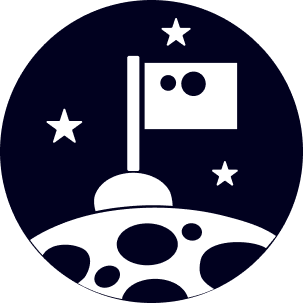
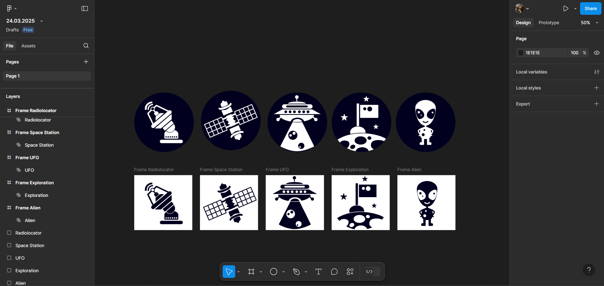

# ПЗ-5: Опрацювання булевих груп у Figma

## Опанування інструментів
У цій роботі ми вивчимо, як використовувати булеві операції у Figma для створення складних форм шляхом додавання і віднімання фігур. 

### Завдання
- Опанувати інструменти по додаванню і відніманню фігур (булеві групи) у Figma.
- Створити **двоє(я створив п`ять)** значків у заливковому стилі (solid), використовуючи булеві групи.

### Результати

<table align="center">
  <tr>
    <td align="center">Frame Radiolocator</td>
    <td align="center">Frame Space Station</td>
    <td align="center">Frame UFO</td>
    <td align="center">Frame Exploration</td>
    <td align="center">Frame Alien</td>
  </tr>
  <tr>
    <td></td>
    <td></td>
    <td></td>
    <td></td>
    <td></td>
  </tr>
</table>

### Процес створення
1. Використання основних фігур (кола, прямокутника, трикутника тощо).
2. Застосування булевих операцій: 
   - **Union** (об'єднання)
   - **Subtract** (віднімання)
   - **Intersect** (перетин)
   - **Exclude** (виключення)
3. Формування фінальних значків у стилі solid.

### Робочий процес

  

### Висновок
Під час виконання завдання було опановано використання булевих груп у Figma. Завдяки цим інструментам можна створювати складні форми швидко та ефективно. Це дозволяє значно покращити процес дизайну та розширити можливості роботи з векторною графікою.

### Посилання на проект у Figma
[Переглянути проект](https://www.figma.com/design/PyqXTpPtZvkqPBkzqya1aT/24.03.2025?node-id=0-1&p=f&t=ICFFINP2G3WlmEKb-0)
